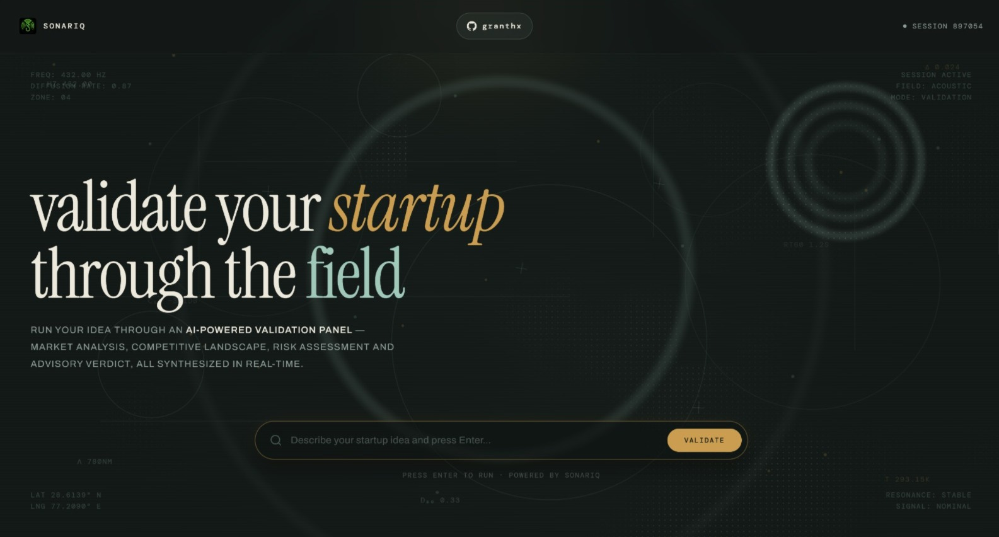

# SonarIQ



> **Validate the signal behind the idea.**

SonarIQ is an AI-powered startup idea validation platform built to help founders evaluate an idea from multiple angles before making an early-stage decision.

Instead of relying on a single model response, SonarIQ runs a structured validation workflow covering:

- Market analysis
- Competitive analysis
- Risk assessment
- Strategic advisory

The results are combined into a final **Strong Go**, **Cautious Go**, or **No-Go** recommendation with supporting reasoning.

---

## What SonarIQ Does

A startup idea enters SonarIQ as a single input. The backend then moves it through a sequence of specialized analysis stages.

### Market Analysis

The market analyst examines the submitted idea and produces market-oriented insights. When additional external information is useful, the model can request a web search through the integrated DuckDuckGo tool.

### Competitive Analysis

The competition stage uses the startup idea together with the completed market analysis to evaluate the competitive landscape and positioning.

### Risk Assessment

The risk stage receives the startup idea, market analysis, and competition analysis and evaluates potential risks and relevant considerations.

### Strategic Advisory

The advisor is the final synthesis stage. It receives the previous analyses and produces a structured decision:

| Recommendation | Meaning |
|---|---|
| **Strong Go** | The available analysis supports moving forward with the idea. |
| **Cautious Go** | The idea has potential, but important uncertainties or risks should be addressed before proceeding confidently. |
| **No-Go** | The analysis identifies substantial issues that make proceeding difficult to justify at this stage. |

The advisor also returns supporting advice explaining the reasoning behind the recommendation.

---

## SonarIQ Workflow

The validation pipeline is implemented as a LangGraph stateful workflow.

```text
                         ┌──────────────────┐
                         │   Startup Idea   │
                         └────────┬─────────┘
                                  │
                                  ▼
                       ┌─────────────────────┐
                       │   Market Analysis   │
                       └──────────┬──────────┘
                                  │
                         Tool call required?
                           ┌──────┴──────┐
                          YES            NO
                           │              │
                           ▼              │
                    ┌──────────────┐      │
                    │ Web Search   │      │
                    │ DuckDuckGo   │      │
                    └──────┬───────┘      │
                           │              │
                           ▼              │
                     ┌─────────────┐      │
                     │ Tool Router │──────┘
                     └──────┬──────┘
                            │
                            ▼
                 ┌────────────────────────┐
                 │ Competitive Analysis   │
                 └────────────┬───────────┘
                              │
                     Tool call required?
                       ┌──────┴──────┐
                      YES            NO
                       │              │
                       ▼              │
                ┌──────────────┐      │
                │ Web Search   │      │
                └──────┬───────┘      │
                       │              │
                       └──────┬───────┘
                              ▼
                    ┌──────────────────┐
                    │  Risk Assessment │
                    └────────┬─────────┘
                             │
                    Tool call required?
                       ┌─────┴─────┐
                      YES          NO
                       │            │
                       ▼            │
                ┌──────────────┐    │
                │ Web Search   │    │
                └──────┬───────┘    │
                       │            │
                       └─────┬──────┘
                             ▼
                    ┌─────────────────┐
                    │ Strategic       │
                    │ Advisor         │
                    └────────┬────────┘
                             │
                             ▼
                 ┌─────────────────────────┐
                 │ Strong Go / Cautious Go │
                 │         / No-Go         │
                 └───────────┬─────────────┘
                             │
                             ▼
                    Validation Report
```

### Tool Failure Handling

SonarIQ has separate fallback versions of the market, competition, and risk analysis nodes.

If a web-search tool call returns `tool_failed`, the workflow can route that stage to its corresponding **chat-model fallback** instead of stopping the entire validation.

This gives the workflow two paths:

```text
Analysis Node
     │
     ├── Web research succeeds ──► Continue with research
     │
     └── Web research fails ──────► Chat-only fallback
                                      │
                                      ▼
                                  Continue flow
```

---

## Architecture

The repository separates the API, workflow, analysis nodes, shared state, model configuration, tools, prompts, and frontend.

```text
SonarIQ/
│
├── backend/
│   ├── main.py
│   ├── app.py
│   ├── config.py
│   ├── requirements.txt
│   ├── pyproject.toml
│   │
│   ├── graphs/
│   │   └── workflow.py
│   │
│   ├── nodes/
│   │   ├── market_analyst.py
│   │   ├── competitor_analysis.py
│   │   ├── risk_assessor.py
│   │   └── advisor.py
│   │
│   ├── state/
│   │   └── agent_state.py
│   │
│   ├── models/
│   │   └── chat_model.py
│   │
│   ├── tools/
│   │   └── web_search_tool.py
│   │
│   └── prompts/
│       ├── market_analyst.txt
│       ├── competitor_analyst_prompt.txt
│       ├── risk_assessor.txt
│       └── advisor.txt
│
└── frontend/
    └── index.html
```

---

## Technology Stack

### Backend

- **Python 3.11+**
- **FastAPI**
- **Uvicorn**
- **Pydantic**

### AI & Workflow

- **LangGraph** for workflow orchestration
- **LangChain Core / Community** for model and tool integration
- **ChatGroq** for the language model
- **Groq API** for model inference

### Research

- **DuckDuckGo Search** through LangChain's search tool integration

### Frontend

SonarIQ's primary interface is a custom HTML/CSS/JavaScript frontend rather than a Streamlit-based UI.

The frontend includes:

- Startup idea input
- Validation pipeline visualization
- Market / Competition / Risk / Verdict stages
- Live validation state
- Recommendation display
- Analysis result panels
- Responsive interface
- Animated visual elements
- GSAP-based motion
- Marked.js for Markdown rendering

---

## Frontend

The SonarIQ frontend is located at:

```text
frontend/index.html
```

It provides the main **SONARIQ — Acoustic Validation Console** interface.

The frontend communicates with the FastAPI backend using a `POST` request to:

```text
/validate
```

The request body is:

```json
{
  "startup_idea": "Your startup idea"
}
```

The frontend then uses the returned analysis to populate the validation interface and display the final recommendation.

---

## Backend API

The FastAPI application is located at:

```text
backend/main.py
```

### `GET /`

Returns the API welcome response.

Example:

```json
{
  "message": "Welcome to the SONARIQ API"
}
```

### `POST /validate`

Runs the complete SonarIQ validation workflow.

#### Request

```json
{
  "startup_idea": "A platform that connects independent tutors with students using AI-powered learning recommendations."
}
```

#### Response

```json
{
  "startup_idea": "Original startup idea",
  "market_analysis": "Market analysis...",
  "competition_analysis": "Competition analysis...",
  "risk_assessment": "Risk assessment...",
  "advisor_recommendations": "Cautious Go",
  "advice": "Strategic reasoning and recommendations..."
}
```

The backend invokes the LangGraph workflow asynchronously and returns the consolidated state after the advisor completes.

---

## State Management

SonarIQ maintains a shared `AgentState` throughout the workflow.

The state contains:

```text
startup_idea
market_analysis
competition_analysis
risk_assessment
advisor_recommendations
advice
messages
```

This allows each stage to consume the information generated by earlier stages.

For example:

```text
Startup Idea
     │
     ▼
Market Analysis
     │
     ├──────────────► Competition Analysis
     │                       │
     │                       └──────► Risk Assessment
     │                                      │
     └──────────────────────────────────────┤
                                            ▼
                                         Advisor
```

---

## Model Configuration

The current backend configuration uses:

```python
REPO_ID = "openai/gpt-oss-20b"
TEMPERATURE = 0.7
MAX_NEW_TOKENS = 2048
```

The model is initialized through `ChatGroq` and uses the `GROQ_API_KEY` environment variable.

Create a `.env` file inside the backend directory:

```env
GROQ_API_KEY=your_groq_api_key_here
```

Do not commit API keys or `.env` files to the repository.

---

## Getting Started

### Requirements

- Python **3.11+**
- A valid **Groq API key**
- Internet access for DuckDuckGo-based research
- A modern browser for the frontend

### 1. Clone the Repository

```bash
git clone <https://github.com/granthx/SonarIQ>
cd SonarIQ
```

### 2. Enter the Backend

```bash
cd backend
```

### 3. Create a Virtual Environment

Windows:

```bash
python -m venv venv
venv\Scripts\activate
```

macOS / Linux:

```bash
python -m venv venv
source venv/bin/activate
```

### 4. Install Dependencies

```bash
pip install -r requirements.txt
```

### 5. Configure the API Key

Create:

```text
backend/.env
```

with:

```env
GROQ_API_KEY=your_groq_api_key_here
```

### 6. Start the Backend

From the `backend` directory:

```bash
uvicorn main:app --reload --host 0.0.0.0 --port 8000
```

The API will be available at:

```text
http://localhost:8000
```

FastAPI documentation:

```text
http://localhost:8000/docs
```

---

## Running the Frontend

The primary frontend is:

```text
frontend/index.html
```

Because it is a static HTML/JavaScript application that communicates with the FastAPI server, it can be served using a simple local HTTP server.

From the `frontend` directory:

```bash
python -m http.server 5500
```

Then open:

```text
http://localhost:5500
```

The frontend sends validation requests to:

```text
http://localhost:8000/validate
```

The backend enables CORS so that the frontend can communicate with the API from a different local origin.

---

## Running the Complete Application

Use two terminals.

### Terminal 1 — Backend

```bash
cd backend
venv\Scripts\activate
uvicorn main:app --reload --host 0.0.0.0 --port 8000
```

### Terminal 2 — Frontend

```bash
cd frontend
python -m http.server 5500
```

Then open:

```text
http://localhost:5500
```

---

## Validation Lifecycle

A typical SonarIQ run looks like this:

```text
1. User enters startup idea
          ↓
2. Frontend sends POST /validate
          ↓
3. FastAPI receives the request
          ↓
4. LangGraph workflow starts
          ↓
5. Market analysis
          ↓
6. Competition analysis
          ↓
7. Risk assessment
          ↓
8. Strategic advisor
          ↓
9. Structured recommendation
          ↓
10. API returns validation report
          ↓
11. Frontend renders results
```

---

## Prompt System

Each major analysis stage has its own prompt file:

```text
backend/prompts/
├── market_analyst.txt
├── competitor_analyst_prompt.txt
├── risk_assessor.txt
└── advisor.txt
```

This keeps the instructions for each analysis stage separate from the Python workflow logic.

The advisor prompt is responsible for synthesizing:

- Startup idea
- Market analysis
- Competition analysis
- Risk assessment

into the final recommendation and supporting advice.

---

## Web Research

SonarIQ exposes a `web_search` tool backed by DuckDuckGo.

The tool:

1. Receives a search query from an analysis model.
2. Executes the DuckDuckGo search.
3. Returns the search result to the workflow.
4. Allows the calling analysis stage to continue with additional context.

The search tool also handles failures by returning:

```text
tool_failed
```

The LangGraph router uses this signal to select the appropriate fallback node.

---

## Error Handling

### API Connection Error

Make sure the FastAPI backend is running:

```bash
uvicorn main:app --reload --host 0.0.0.0 --port 8000
```

### Groq API Key Error

If the backend reports that `GROQ_API_KEY` is not set, verify:

```env
GROQ_API_KEY=your_groq_api_key_here
```

inside:

```text
backend/.env
```

### Search Failure

A DuckDuckGo failure does not necessarily stop the validation. The workflow can move the affected analysis stage to its chat-only fallback.

### Frontend Cannot Reach Backend

Verify:

```text
Frontend: http://localhost:5500
Backend:  http://localhost:8000
```

Also check that the FastAPI server is running and that the browser is loading the frontend through an HTTP server rather than relying on a `file://` URL.

---

## Project Structure Notes

The repository currently contains a `backend/app.py` Streamlit application from the earlier project structure. The primary user interface, however, is the custom frontend located at:

```text
frontend/index.html
```

The current backend model implementation uses `ChatGroq` and `GROQ_API_KEY`.

Before publishing the repository, make sure the dependency files are synchronized with the current implementation, particularly the Groq integration.

---

## Limitations

SonarIQ is an early-stage validation and decision-support system. Its recommendations should not be treated as definitive proof that a startup will succeed or fail.

The output depends on:

- The quality of the submitted idea
- Model reasoning
- Available web-search information
- External service availability
- API limits
- The accuracy of information available to the analysis agents

A **Strong Go** recommendation is not a guarantee of commercial success, and a **No-Go** recommendation should be treated as a signal for further investigation rather than an absolute business judgment.

---

## Roadmap

Possible future improvements:

- [ ] Startup idea scoring across multiple dimensions
- [ ] Market-size estimation
- [ ] TAM / SAM / SOM analysis
- [ ] Business-model evaluation
- [ ] Customer persona analysis
- [ ] Competitor comparison matrix
- [ ] Financial feasibility analysis
- [ ] Evidence and source tracking
- [ ] PDF report export
- [ ] Validation history
- [ ] Multiple-idea comparison
- [ ] Authentication and user accounts
- [ ] Persistent project storage
- [ ] Deployment-ready configuration
- [ ] More advanced visual analytics

---

## Contributing

Contributions are welcome.

1. Fork the repository.
2. Create a new branch:

```bash
git checkout -b feature/your-feature
```

3. Make your changes.
4. Commit them:

```bash
git commit -m "Add your feature"
```

5. Push the branch:

```bash
git push origin feature/your-feature
```

6. Open a Pull Request.

---

## License

This project is licensed under the **MIT License**.

See the `LICENSE` file for details.

---

## SonarIQ

**Listen to the signal. Validate the idea. Make the decision.**
